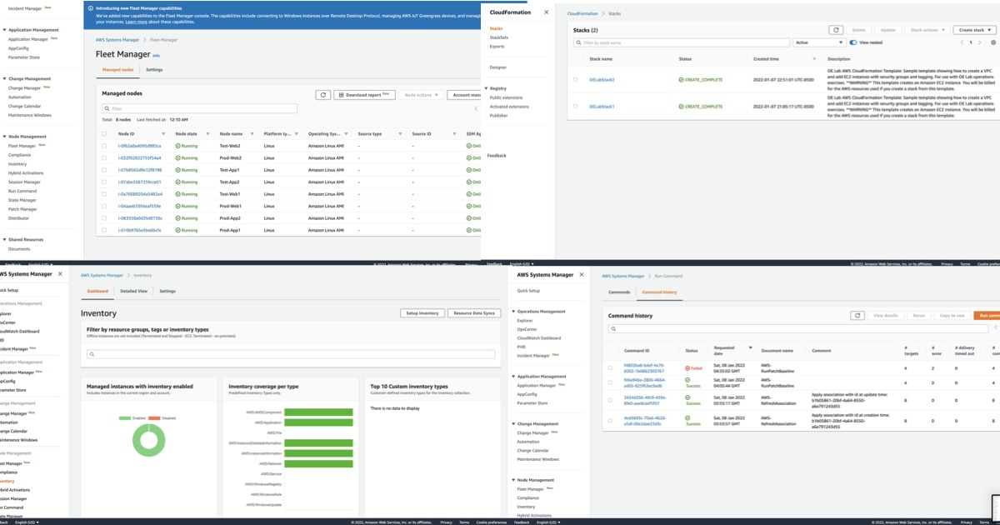

# How do you reduce defects, ease remediation, and improve flow into production?

Located here: https://docs.aws.amazon.com/wellarchitected/latest/framework/a-prepare.html

✍️ I was able to apply the concepts of Infrastructure as Code and Operations as Code to do:

- Automation of deployment of infrastructure, 
- Dynamic management of resources, 
- Automation patch managements,
- Create CronJobs + SNS messages
